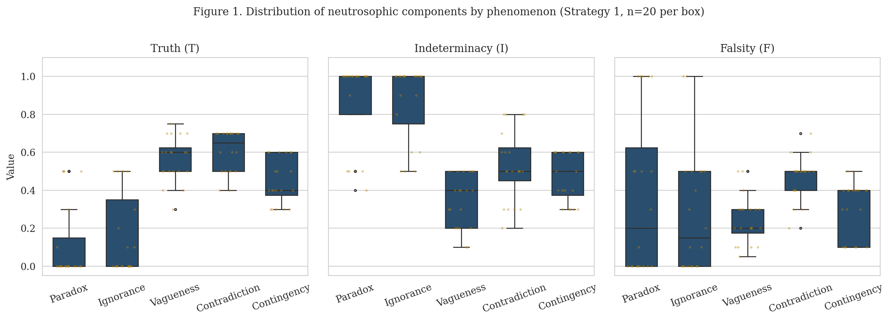
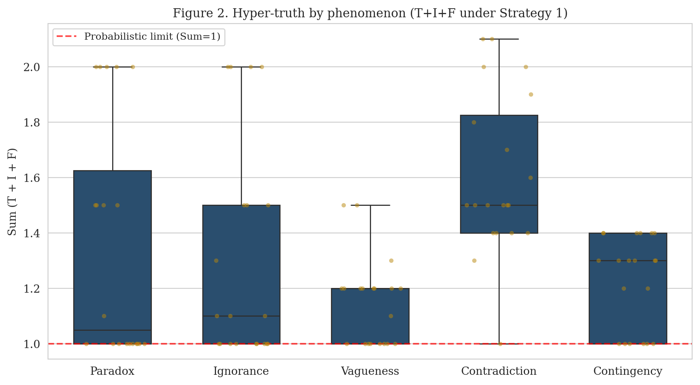
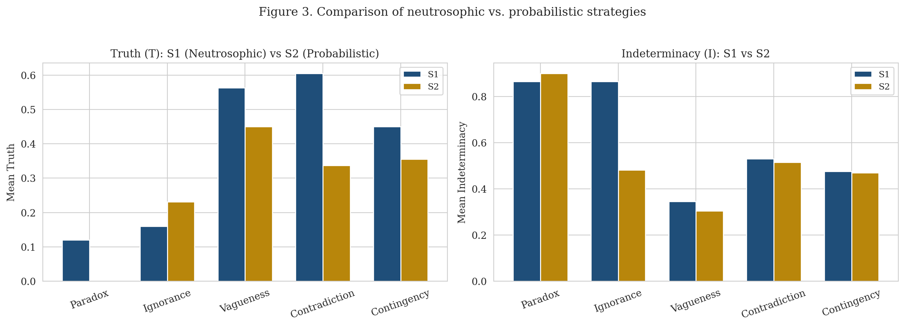
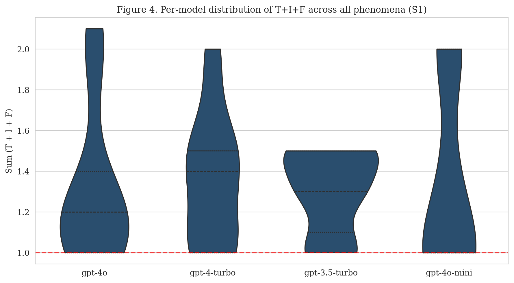
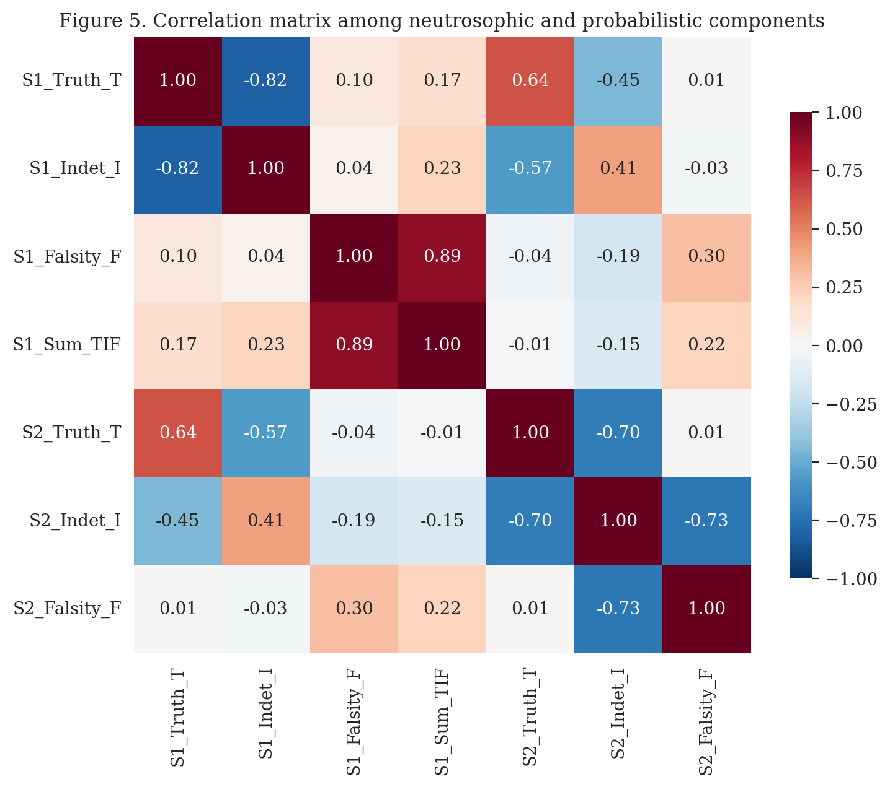
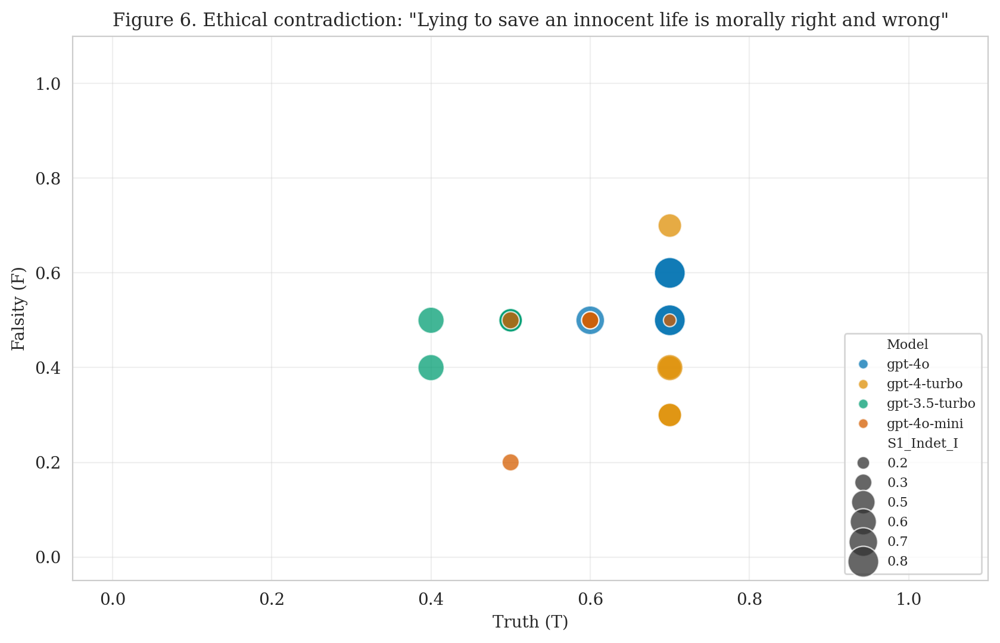

# Breaking the Chains of Probability: Neutrosophic Logic as a New Framework for Epistemic Uncertainty in Large Language Models

Maikel Yelandi Leyva-Vázquez ¹\*, ORCID 0000-0002-9486-5093
Florentin Smarandache ², ORCID 0000-0002-5560-5926

¹ Universidad Bolivariana del Ecuador, Coordinación Académica de Posgrado, Guayaquil, Ecuador.
² Mathematics, Physics, and Natural Sciences Division, University of New Mexico, Gallup, NM 87301, USA.
\* Corresponding author: mleyvaz@gmail.com

> **Manuscript version 2.0 (April 2026).** This version reports n=100 evaluations (5 repetitions per cell over 4 OpenAI models, 5 phenomena, 3 strategies) and incorporates the cross-vendor replication of Mason (2026, arXiv:2604.09602). The original v1.0 (December 2025, n=20) is archived as `paper/FINAL_PAPER_v1_archived.md`.

## Abstract

Large Language Models (LLMs) are predominantly governed by probabilistic frameworks in which the sum of outcome probabilities is constrained to unity. This limitation, often imposed by Softmax layers, leads to a *collapse of uncertainty* that conflates ignorance, paradox, and vagueness. We present an empirical investigation of the application of Neutrosophic Logic — a framework that treats Truth (T), Indeterminacy (I), and Falsity (F) as three independent dimensions on [0, 1] — to elicit declared epistemic states from LLMs. Across **300 API calls — including 100 valid unconstrained neutrosophic evaluations — on four OpenAI GPT models and five linguistic phenomena (five repetitions per cell)**, the neutrosophic strategy yields *hyper-truth* (T + I + F > 1) in **66.0% of Strategy-1 evaluations**, with the highest rates observed in ethical contradiction (95%) and future contingency (70%). A Pearson χ² test of phenomenon × hyper-truth association is significant (χ² = 11.32, df = 4, p = 0.023). Mason (2026) independently replicated and extended an earlier release of this work across five additional model families from five different vendors, reporting hyper-truth in 84% of unconstrained evaluations. We do not claim that hyper-truth is an intrinsic latent variable inside the model; rather, that unconstrained neutrosophic prompting elicits declared epistemic states that probabilistic prompting structurally suppresses by Proposition 1.

**Keywords:** neutrosophic logic; large language models; epistemic uncertainty; hyper-truth; uncertainty quantification; indeterminacy; ethical AI; paradox.

**Reproducibility.** All code, prompts, raw data, and figures of this study are openly released under the MIT License at the public repository:

> **https://github.com/mleyvaz/neutrosophic-llm-logic**

The v2.0 release (this study, *N* = 100) is the current state of the `main` branch and is also tagged as [`v2.0`](https://github.com/mleyvaz/neutrosophic-llm-logic/tree/v2.0). The v1.0 release (December 2025, *N* = 20) is preserved at tag [`v1.0`](https://github.com/mleyvaz/neutrosophic-llm-logic/tree/v1.0) and at the file `paper/FINAL_PAPER_v1_archived.md`. The v2.0 release has been permanently archived in Zenodo with DOI **10.5281/zenodo.19911845**.

## 1. Introduction

The deployment of Large Language Models (LLMs) in high-stakes domains has made robust uncertainty quantification (UQ) a first-order requirement [1, 2, 3]. Yet the underlying architecture of contemporary LLMs is rooted in probability theory, where outcome probabilities are constrained to sum to unity by Softmax normalization [4, 5]. This forces a zero-sum game in which any increase in uncertainty must subtract from truth or falsity, a phenomenon we term the *collapse of uncertainty* [6]. The constraint hinders the ability of LLMs to distinguish between aleatoric uncertainty (statistical uncertainty inherent in the data) and epistemic uncertainty (model uncertainty due to lack of knowledge) [7, 8], and in particular between *not knowing* (ignorance) and *knowing of a conflict* (paradox or contradiction).

Recent work on UQ for LLMs has explored several alternatives, including semantic entropy with linguistic invariances [9], self-consistency checks via SelfCheckGPT [10], and conformal abstention policies [3]. These approaches address calibration and abstention but operate within probabilistic representations and inherit their structural limitations.

Neutrosophic Logic, introduced by Smarandache [11], offers an alternative semantic foundation. It generalizes fuzzy and intuitionistic fuzzy logics by introducing three independent components — Truth (T), Indeterminacy (I), and Falsity (F) — each a real number in [0, 1], without the constraint that they sum to unity. This freedom allows the simultaneous expression of high truth, high falsity, and high indeterminacy, a state we call *hyper-truth* (T+I+F > 1). We hypothesize that under unconstrained neutrosophic prompting, current LLMs will exhibit hyper-truth at non-trivial rates specifically in cases of paradox and ethical contradiction, while probabilistic prompting will not. The remainder of this paper tests this hypothesis empirically.

Mason (2026) [12] independently replicated and extended the v1.0 release of the present work (December 2025, *N* = 20) across five additional model families from five different vendors (Anthropic, Meta, DeepSeek, Alibaba, Mistral), reporting hyper-truth in 84% of unconstrained evaluations and confirming that the phenomenon is cross-vendor rather than an OpenAI-specific artifact. The present v2.0 manuscript responds to Mason's replication by increasing the sample size to *N* = 100 (5 repetitions per cell across the original four OpenAI models), formalising the SVNS apparatus, and clarifying that the central claim concerns *declared* epistemic states elicited by unconstrained prompting rather than intrinsic latent variables of the model.

## 2. Background and Methods

### 2.1. Neutrosophic Logic: Formal Preliminaries

We use the standard formulation of single-valued neutrosophic logic [11, 13]. We collect here the definitions and propositions that the empirical sections will instantiate.

**Definition 1 (Single-Valued Neutrosophic Set, Smarandache 1998 [11]).** Let *X* be a universe of discourse. A *single-valued neutrosophic set* (SVNS) *A* on *X* is the set of ordered quadruples

A = { ⟨x, T_A(x), I_A(x), F_A(x)⟩ : x ∈ X },

where, for every element *x* in *X*, the values T_A(x), I_A(x), and F_A(x) denote, respectively, the truth-membership degree, the indeterminacy-membership degree, and the falsity-membership degree of *x* in *A*. Each of these three functions maps *X* to the unit interval [0, 1], and no constraint is imposed on their sum, which therefore lies in [0, 3].

**Definition 2 (Neutrosophic Evaluation of a Statement).** Given a statement *s* and an evaluator *E*, the *neutrosophic evaluation* of *s* by *E* is the ordered triple

n_E(s) = (T_E(s), I_E(s), F_E(s)) ∈ [0, 1]³,

where T_E(s), I_E(s), and F_E(s) denote, respectively, the truth degree, indeterminacy degree, and falsity degree assigned by evaluator *E* to statement *s*. When the evaluator is fixed throughout the analysis, we write simply n(s) = (T, I, F).

**Definition 3 (Hyper-truth).** A neutrosophic evaluation n(s) = (T, I, F) ∈ [0, 1]³ is said to exhibit *hyper-truth* if and only if its three components satisfy T + I + F > 1. The *hyper-truth region* is the subset

H = { (T, I, F) ∈ [0, 1]³ : T + I + F > 1 } ⊂ [0, 1]³,

which collects every triple whose component-wise sum strictly exceeds unity.

**Definition 4 (Strategy Mappings).** Each prompting strategy S_k induces a mapping S_k : *Statements* → [0, 1]³:

- **S₁ (neutrosophic):** S₁(s) = (T₁, I₁, F₁) ∈ [0, 1]³, with no further constraint.
- **S₂ (probabilistic):** S₂(s) = (T₂, I₂, F₂) ∈ [0, 1]³ subject to T₂ + I₂ + F₂ = 1.
- **S₃ (entropy-derived):** S₃(s) = (P_yes, H_3, P_no) where P_yes + P_no = 1 and H_3 is the binary Shannon entropy

H_3 = −[ p · log₂(p) + (1 − p) · log₂(1 − p) ],   p = P_yes.

**Proposition 1 (Structural Exclusion of Hyper-truth under S₂).** Under Strategy 2, hyper-truth is structurally impossible: for every statement *s*, S₂(s) ∉ H.

*Proof.* By Definition 4, S₂(s) satisfies T₂ + I₂ + F₂ = 1, while membership in H requires T + I + F > 1. The two conditions are mutually exclusive. ∎

The proposition explains why S₂ is the natural baseline: any non-zero hyper-truth rate observed under S₁ is necessarily a representational gain that S₂ could not produce.

**Proposition 2 (Non-Injectivity of the Scalar Projection).** Let π : [0, 1]³ → ℝ be the scalar projection π(T, I, F) = T + I + F. Then π is non-injective, hence the scalar sum is sufficient for hyper-truth detection but not for the discrimination of distinct epistemic regimes.

*Proof.* The triples (0.5, 0.5, 0.5) and (0, 1, 0.5) both yield π = 1.5 yet differ in their first component. ∎

This proposition will reappear in §4: it motivates the plithogenic extension of [13], which augments the scalar with attribute structure precisely to recover the discriminations that π collapses.

**Definition 5 (Hyper-truth Rate).** Let D = { n_i }, with i = 1, 2, …, N, be a finite set of N neutrosophic evaluations produced under a fixed strategy. The *hyper-truth rate* of D is the empirical proportion

ρ(D) = (1 / N) · |{ i : n_i ∈ H }| = (1 / N) · ∑_{i = 1}^{N} 𝕀[ T_i + I_i + F_i > 1 ],

where the indicator function 𝕀[·] returns 1 when its argument is true and 0 otherwise. In words: ρ(D) is the fraction of evaluations in *D* whose three components sum to strictly more than one.

**Definition 6 (Strategy Shift).** For a component C ∈ {T, I, F} and a phenomenon class *p*, the *strategy shift* between Strategy 1 and Strategy 2 is the difference of conditional expectations

Δ_C(p) = 𝔼[ C₁(s) | s ∈ p ] − 𝔼[ C₂(s) | s ∈ p ],

where C₁(s) and C₂(s) are the values of component C produced by Strategy 1 and Strategy 2, respectively, on statement *s*. In words: Δ_C(p) is the average increase (or decrease) in component C contributed by the unconstrained neutrosophic prompting relative to the probabilistic prompting, conditional on phenomenon *p*. A positive Δ_C indicates that the probabilistic constraint suppresses component C in that phenomenon class; a negative Δ_C indicates inflation.

The neutrosophic operators of intersection, union, and negation extend the classical fuzzy operators componentwise on [0, 1]³ [11], and reduce to the standard SVNS operators when applied to triples that satisfy the corresponding sub-class constraints (probabilistic, intuitionistic, fuzzy). In particular, neutrosophic logic is strictly more expressive than the intuitionistic fuzzy sets of Atanassov [14], which require T + F ≤ 1, and a fortiori than probability distributions over a 3-partition.

### 2.2. Linguistic Phenomena

We selected five linguistic phenomena to test the models' reasoning capabilities:

- **Logical Paradoxes:** statements that lead to self-contradiction (e.g., *"This sentence is false."*).
- **Epistemic Ignorance:** statements whose truth value is unknown in principle (e.g., *"The number of stars in the universe is even."*).
- **Vagueness (Fuzzy Logic):** statements with imprecise boundaries (e.g., *"John is 1.75 meters tall, therefore John is tall."*).
- **Ethical Contradictions:** dilemmas where moral principles conflict (e.g., *"Lying to save an innocent life is morally right and wrong at the same time."*).
- **Future Contingencies:** statements about future events that are not yet determined (e.g., *"It will rain in New York tomorrow."*).

### 2.3. Evaluation Strategies

We employed three distinct prompting strategies (full prompt text in Appendix A):

1. **Strategy 1 (Neutrosophic):** the model is instructed to evaluate the statement on three independent dimensions T, I, F ∈ [0, 1], explicitly stated as not constrained to sum to unity.
2. **Strategy 2 (Probabilistic):** the model is instructed to assign probabilities to three mutually exclusive states (True, Uncertain, False) summing to 1.0.
3. **Strategy 3 (Entropy-Derived):** the model estimates P(yes) and P(no) summing to 1.0; we derive I = −[p·log₂(p) + (1−p)·log₂(1−p)] via Shannon entropy [15].

### 2.4. Models, Repetitions, and Reproducibility

**Models and parameters.** The experiment involved four OpenAI models, accessed via the OpenAI Chat Completions API on 30 April 2026: `gpt-4o` (model snapshot returned by the default alias on the date of access), `gpt-4-turbo`, `gpt-3.5-turbo`, and `gpt-4o-mini`. All calls used `temperature = 0.7`, default `top_p`, no fixed `seed`, and a soft response-format constraint instructing the model to return only a JSON object. No `max_tokens` cap was imposed; responses fit within the default. The experiment ran in approximately 5.6 minutes of wall-clock time.

**Design.** Each combination of (model × phenomenon × strategy) was evaluated five times in independent API calls, yielding 4 × 5 × 5 = 100 cells per strategy and a total of 300 API calls. The five repetitions per cell are stochastic prompt-level replicates rather than independent human-labeled items; we discuss this caveat in §4.

**Future-contingency anchoring.** Because the future-contingency phenomenon evaluates "It will rain in New York tomorrow", the referential statement depends on the date of execution. All 25 future-contingency calls were made on 30 April 2026, so "tomorrow" denotes 1 May 2026 throughout the dataset.

**Exclusion criteria.** A response was considered *valid* if it parsed as a well-formed JSON object containing the required fields (`T`, `I`, `F` for S1 and S2; `P_yes`, `P_no` for S3) with each numeric value within the unit interval. All 300 calls returned valid JSON; the *N* = 100 reported per strategy is therefore both the gross and net sample size.

**Reproducibility.** All code, prompts, and raw data are openly released at [github.com/mleyvaz/neutrosophic-llm-logic](https://github.com/mleyvaz/neutrosophic-llm-logic) under the MIT License. The exact replication script is [`src/run_experiment.py`](https://github.com/mleyvaz/neutrosophic-llm-logic/blob/main/src/run_experiment.py); the v2.0 dataset is [`data/openai_neutrosophic_results_v2.csv`](https://github.com/mleyvaz/neutrosophic-llm-logic/blob/main/data/openai_neutrosophic_results_v2.csv).

## 3. Results

### 3.1. Descriptive Statistics

**Table 1.** Descriptive statistics for neutrosophic components (Strategy 1) by phenomenon. Mean ± standard deviation, n = 20 per row.

| Phenomenon | Truth (T) | Indeterminacy (I) | Falsity (F) | Sum (T+I+F) | n |
|---|---|---|---|---|---|
| Contingency (Future) | 0.450 ± 0.119 | 0.475 ± 0.129 | 0.305 ± 0.147 | 1.230 ± 0.166 | 20 |
| Contradiction (Ethical) | 0.605 ± 0.110 | 0.530 ± 0.187 | 0.470 ± 0.113 | 1.605 ± 0.293 | 20 |
| Ignorance (Epistemic) | 0.160 ± 0.216 | 0.865 ± 0.201 | 0.280 ± 0.324 | 1.305 ± 0.398 | 20 |
| Paradox (Logical) | 0.120 ± 0.207 | 0.865 ± 0.230 | 0.370 ± 0.421 | 1.355 ± 0.429 | 20 |
| Vagueness (Fuzzy) | 0.562 ± 0.118 | 0.345 ± 0.139 | 0.242 ± 0.127 | 1.150 ± 0.157 | 20 |

**Table 2.** Per-model summary across all five phenomena (Strategy 1). Mean ± standard deviation, n = 25 per row.

| Model | Truth (T) | Indeterminacy (I) | Falsity (F) | Sum (T+I+F) | n |
|---|---|---|---|---|---|
| gpt-3.5-turbo | 0.374 ± 0.183 | 0.576 ± 0.183 | 0.354 ± 0.179 | 1.304 ± 0.203 | 25 |
| gpt-4-turbo | 0.448 ± 0.254 | 0.628 ± 0.253 | 0.284 ± 0.206 | 1.360 ± 0.319 | 25 |
| gpt-4o | 0.332 ± 0.272 | 0.720 ± 0.248 | 0.260 ± 0.214 | 1.312 ± 0.373 | 25 |
| gpt-4o-mini | 0.364 ± 0.307 | 0.540 ± 0.373 | 0.436 ± 0.387 | 1.340 ± 0.442 | 25 |

### 3.2. Distribution of Neutrosophic Components

*Figure 1. Distribution of the neutrosophic components (Truth, Indeterminacy, Falsity) for each linguistic phenomenon under Strategy 1 (boxplot + strip plot, n = 20 per box).*

### 3.3. Hyper-truth: Breaking the Probabilistic Constraint

Across the *N* = 100 valid Strategy-1 evaluations, the empirical hyper-truth rate (Definition 5) is

ρ̂(D_S₁) = 66 / 100 = 0.660.

The 95% Wilson score confidence interval for a binomial proportion with k = 66 successes in N = 100 is

CI₉₅%(ρ̂) = [ ρ̂ + (z²/(2N)) ± z·√( ρ̂(1−ρ̂)/N + z²/(4N²) ) ] / (1 + z²/N) ≈ [0.563, 0.747],   z = 1.96.

The lower bound 0.563 already exceeds any reasonable null hypothesis of zero hyper-truth, and the entire interval is well above the structural bound ρ(D_S₂) = 0 implied by Proposition 1. The phenomenon is concentrated in ethical contradiction and future contingency, as Table 3 shows.

**Test of phenomenon × hyper-truth association.** A Pearson χ² test of independence between phenomenon class and hyper-truth status (5 × 2 contingency table) yields χ² = 11.32 with df = 4 and p = 0.023, allowing rejection of independence at α = 0.05. One-vs-rest Fisher exact tests identify ethical contradiction as the only phenomenon whose hyper-truth rate is significantly higher than the rest of the dataset (odds ratio = 13.34, p = 0.0014); the remaining four phenomena are not individually distinguishable from the pooled baseline at α = 0.05. The chi-square result confirms that hyper-truth incidence is heterogeneous across phenomena and that ethical contradiction is the principal driver of that heterogeneity.

**Table 3.** Hyper-truth rate by phenomenon. *k* denotes the number of evaluations with T + I + F > 1; *n* denotes the total number of evaluations per phenomenon; the rate is computed as *k* / *n* · 100%.

| Phenomenon | Hyper-truth cases (*k*) | Total (*n*) | Hyper-truth rate (*k* / *n*) |
|---|---|---|---|
| Contradiction (Ethical) | 19 | 20 | **95.0%** |
| Contingency (Future) | 14 | 20 | 70.0% |
| Vagueness (Fuzzy) | 12 | 20 | 60.0% |
| Ignorance (Epistemic) | 11 | 20 | 55.0% |
| Paradox (Logical) | 10 | 20 | 50.0% |

*Figure 2. Distribution of T+I+F under Strategy 1 by phenomenon. Bars exceeding the dashed line at Sum = 1 violate the probabilistic constraint and exhibit hyper-truth.*

### 3.4. Comparison of Neutrosophic and Probabilistic Strategies

**Table 4.** Strategy 1 vs. Strategy 2 differences in mean values per phenomenon.

| Phenomenon | S1 T | S2 T | Δ T | S1 I | S2 I | Δ I |
|---|---|---|---|---|---|---|
| Contingency (Future) | 0.450 | 0.355 | +0.095 | 0.475 | 0.470 | +0.005 |
| Contradiction (Ethical) | 0.605 | 0.338 | **+0.267** | 0.530 | 0.515 | +0.015 |
| Ignorance (Epistemic) | 0.160 | 0.231 | −0.071 | 0.865 | 0.482 | **+0.383** |
| Paradox (Logical) | 0.120 | 0.000 | +0.120 | 0.865 | 0.900 | −0.035 |
| Vagueness (Fuzzy) | 0.562 | 0.450 | +0.112 | 0.345 | 0.305 | +0.040 |

The largest absolute strategy shifts are observed for ethical contradiction in the truth component, with Δ_T = +0.267, and for epistemic ignorance in the indeterminacy component, with Δ_I = +0.383. Both are positive, indicating that the probabilistic constraint of Strategy 2 suppresses precisely the components that Strategy 1 allows the model to communicate.

*Figure 3. Comparison of mean Truth (T) and Indeterminacy (I) values between Strategy 1 (neutrosophic) and Strategy 2 (probabilistic) across the five phenomena.*

### 3.5. Per-Model Analysis

*Figure 4. Per-model distribution of T+I+F across all five phenomena under Strategy 1.*

### 3.6. Correlation Analysis

*Figure 5. Correlation matrix among Strategy 1 and Strategy 2 components.*

### 3.7. Critical Case: Ethical Contradiction

*Figure 6. Per-model neutrosophic components for the ethical contradiction "Lying to save an innocent life is morally right and wrong." Marker size encodes Indeterminacy (I).*

## 4. Discussion

Our results are consistent with the hypothesis stated in Section 1: under unconstrained neutrosophic prompting, current LLMs declare hyper-truth at a non-trivial rate (66.0%), with the highest rate occurring for ethical contradiction (95%) and the chi-square test rejecting independence between phenomenon and hyper-truth at α = 0.05.

**Framing of the central claim.** We do not claim that hyper-truth is an intrinsic latent variable directly observed inside the model. Strategy 1 explicitly *affords* the model the option of returning three independent components on [0, 1]; the resulting frequency of hyper-truth is therefore a representational *affordance* finding, not a latent-variable measurement. The contribution is correspondingly framed as: *unconstrained neutrosophic prompting elicits a class of declared epistemic states that probabilistic prompting cannot represent by construction* (Proposition 1). This is structural rather than empirical superiority — Strategy 2 is excluded from the hyper-truth region by construction, so any non-zero rate under Strategy 1 is a representational gain that Strategy 2 could not produce.

The relationship to other UQ frameworks is straightforward. Semantic entropy [9] estimates indeterminacy from the distribution of paraphrases of the model output; it remains a probabilistic measure and therefore cannot represent hyper-truth. SelfCheckGPT [10] performs consistency checks across stochastic samples and reports a binary or scalar consistency score, which collapses the conflict-versus-ignorance distinction we recover. Conformal abstention [3] addresses *when* a model should refuse to answer; it does not describe the *structure* of the uncertainty when the model does answer. The neutrosophic framework is complementary to these approaches: it provides a richer descriptive language for the epistemic state, on top of which calibration and abstention policies can still operate.

The framework also preserves truth values in fuzzy contexts, where probabilistic representations tend to penalize partial truths. The ability to distinguish ignorance (high I, low T, low F) from contradiction (high T and high F simultaneously) is a feature lost in standard probabilistic and entropy-based methods.

**Limitations.** We acknowledge four constraints on the present claims. *First*, the hyper-truth observation is partly a representational affordance of the unconstrained prompt and is not, by itself, a measurement of an intrinsic latent variable (see "Framing of the central claim" above). *Second*, the five repetitions per cell are stochastic prompt-level replicates rather than independent human-labeled items; the *N* = 100 reported is therefore an effective sample size at the cell × repetition level, not at the level of independently sampled stimuli. The Wilson interval and chi-square test should be read accordingly. *Third*, the five phenomena form a small probe set, and the framework requires calibration of how the components relate to ground truth in downstream tasks. *Fourth*, the future-contingency stimulus is anchored to a specific date (1 May 2026), so its referential content is fixed only for replications that hold the date constant. The next natural extension is to enrich the representation with explicit attribute decomposition. The *plithogenic neutrosophic structure* of Smarandache [13] is the 5-tuple

𝒫 = (P, v, V, d, c)

where *P* is a set of plithogenic elements (in our setting, statements), *v* is the dominant attribute, *V* = { v₁, …, v_k } is the spectrum of attribute values, d : P × V → [0, 1]³ is the per-attribute neutrosophic membership, and c : V × V → [0, 1] is the *contradiction function* with c(v, v) = 0 and c(vᵢ, vⱼ) = c(vⱼ, vᵢ). The scalar SVNS evaluation of Definition 2 is recovered as the marginal of d aggregated over V.

The non-injectivity of the scalar projection π (Proposition 2) is precisely what motivates the plithogenic refinement: distinct evaluations with the same scalar projection π(d) but disjoint attribute spectra V₁ ∩ V₂ = ∅ become formally non-isomorphic plithogenic objects, recovering the discriminations that the scalar collapses. We pursue this connection in a companion note that responds to Mason [12].

## 5. Conclusion

We have presented an empirical investigation of neutrosophic logic applied to declared epistemic uncertainty in large language models, framed within a formal SVNS apparatus. The unconstrained T / I / F protocol elicits hyper-truth in 66.0% of evaluations across the four-model ensemble, with Wilson 95% confidence interval [0.563, 0.747]. The highest rates were observed in ethical contradictions and future contingencies, followed by vagueness, epistemic ignorance, and logical paradox; only ethical contradiction is significantly above the pooled baseline at α = 0.05. Mason [12] has independently confirmed cross-vendor generality of the phenomenon at 84% across five additional vendors. The next steps in this line of work are: (i) extension to plithogenic neutrosophic structures with explicit attribute decomposition (P, v, V, d, c) — pursued in a companion note that responds to Mason [12]; (ii) larger phenomenon banks beyond the current five; and (iii) integration of neutrosophic evaluation layers into agentic AI pipelines for high-stakes domains.

## Author Contributions

M.Y.L.-V. conceived the study, designed the experiments, implemented the code, analyzed the data, and drafted the manuscript. F.S. contributed the foundational neutrosophic logic framework, critically reviewed the manuscript, and approved the final version.

## Funding

This research received no external funding.

## Conflicts of Interest

The authors declare no conflict of interest.

## Data Availability

All code, prompts, raw data, and figures supporting this study are publicly available in the GitHub repository [`mleyvaz/neutrosophic-llm-logic`](https://github.com/mleyvaz/neutrosophic-llm-logic) under the MIT License, and have been permanently archived in Zenodo as version v2.0 with DOI **10.5281/zenodo.19911845**. The v2.0 release archived in Zenodo corresponds exactly to the experimental design reported in this manuscript: four OpenAI models, five linguistic phenomena, three prompting strategies, five repetitions per cell, 300 total API calls, and 100 valid unconstrained neutrosophic evaluations. The v1.0 dataset (n=20, December 2025) is preserved at `data/openai_neutrosophic_results.csv`; the v2.0 dataset (n=100, April 2026) is at `data/openai_neutrosophic_results_v2.csv`.

## Acknowledgments

The authors thank Tony Mason (University of British Columbia and Georgia Institute of Technology) for the independent cross-vendor replication of the hyper-truth phenomenon and for the open release of his data and code, which has stimulated the present line of research toward a richer plithogenic foundation.

## Appendix A. Prompt Strategies

### A.1. Strategy 1 (Neutrosophic)

**System:** "You are an expert in Neutrosophic Logic. You evaluate statements using three INDEPENDENT dimensions: Truth (T), Indeterminacy (I), and Falsity (F), each on [0.0, 1.0]. These dimensions are NOT constrained to sum to 1.0. A statement can be simultaneously partially true AND partially false AND partially indeterminate. Respond with ONLY a JSON object, no other text."

**User:** Evaluate this statement on three independent dimensions: Statement: "{statement}" – Truth (T): To what degree is this statement true? [0.0 to 1.0] – Indeterminacy (I): To what degree is the truth value unknown, undetermined, or inherently uncertain? [0.0 to 1.0] – Falsity (F): To what degree is this statement false? [0.0 to 1.0] T, I, and F are independent. They need NOT sum to 1.0. Respond with ONLY: `{"T": , "I": , "F": }`

### A.2. Strategy 2 (Probabilistic)

**System:** "You are a probabilistic classifier. You assign probabilities to three mutually exclusive categories that MUST sum to exactly 1.0. Respond with ONLY a JSON object, no other text."

**User:** Classify this statement into three mutually exclusive categories whose probabilities sum to 1.0: Statement: "{statement}" – T (True): Probability the statement is true – I (Uncertain): Probability the truth value is unknown or undetermined – F (False): Probability the statement is false. CONSTRAINT: T + I + F must equal 1.0. Respond with ONLY: `{"T": , "I": , "F": }`

### A.3. Strategy 3 (Entropy-Derived)

**System:** "You are a binary truth estimator. You estimate the probability that a statement is true (YES) versus false (NO). The two probabilities must sum to 1.0. Respond with ONLY a JSON object, no other text."

**User:** "Estimate the probability that this statement is true versus false: Statement: \"{statement}\" — P_yes: Probability the statement is true, in the closed interval [0.0, 1.0]; P_no: Probability the statement is false, in the closed interval [0.0, 1.0]. CONSTRAINT: P_yes + P_no must equal 1.0. Respond with ONLY: `{\"P_yes\": <value>, \"P_no\": <value>}`."

**Post-processing.** Indeterminacy is then derived externally from the Shannon binary entropy of the elicited distribution:

I = −[ p · log₂(p) + (1 − p) · log₂(1 − p) ],   where p = P_yes.

This yields a derived triple (T, I, F) = (P_yes, I, P_no) which can then be compared against Strategies 1 and 2 within a single notational frame.

## References

[1] Brown, T.B.; Mann, B.; Ryder, N.; et al. Language models are few-shot learners. *Advances in Neural Information Processing Systems* **2020**, 33, 1877–1901.

[2] Shorinwa, O.; Mei, Z.; Lidard, J.; Ren, A.; Majumdar, A. A survey on uncertainty quantification of large language models. *arXiv preprint* **2024**, arXiv:2412.05563.

[3] Yadkori, Y.A.; Kuzborskij, I.; Stutz, D.; et al. Mitigating LLM hallucinations via conformal abstention. *arXiv preprint* **2024**, arXiv:2405.01563.

[4] Gal, Y.; Ghahramani, Z. Dropout as a Bayesian approximation: representing model uncertainty in deep learning. In *Proceedings of the 33rd International Conference on Machine Learning* **2016**; pp. 1050–1059.

[5] Guo, C.; Pleiss, G.; Sun, Y.; Weinberger, K.Q. On calibration of modern neural networks. In *Proceedings of the 34th International Conference on Machine Learning* **2017**; pp. 1321–1330.

[6] Veličković, P. Softmax is not enough (for sharp size generalisation). In *ICLR* **2022**.

[7] Hüllermeier, E.; Waegeman, W. Aleatoric and epistemic uncertainty in machine learning: an introduction to concepts and methods. *Machine Learning* **2021**, 110(3), 457–506.

[8] Valdenegro-Toro, M. A deeper look into aleatoric and epistemic uncertainty estimation. *arXiv preprint* **2022**, arXiv:2204.09308.

[9] Kuhn, L.; Gal, Y.; Farquhar, S. Semantic uncertainty: linguistic invariances for uncertainty estimation in natural language generation. In *ICLR* **2023**.

[10] Manakul, P.; Liusie, A.; Gales, M.J.F. SelfCheckGPT: zero-resource black-box hallucination detection for generative large language models. In *EMNLP* **2023**.

[11] Smarandache, F. *A Unifying Field in Logics: Neutrosophy. Neutrosophic Probability, Set, and Logic*; American Research Press: Rehoboth, NM, USA, 1998.

[12] Mason, T. From scalars to tensors: declared losses recover epistemic distinctions that neutrosophic scalars cannot express. *arXiv preprint* **2026**, arXiv:2604.09602.

[13] Smarandache, F. Plithogenic Set: An Extension of Crisp, Fuzzy, Intuitionistic Fuzzy, and Neutrosophic Sets — Revisited. *Neutrosophic Sets and Systems* **2018**, 21, 153–166.

[14] Atanassov, K. Intuitionistic fuzzy sets. *Fuzzy Sets and Systems* **1986**, 20(1), 87–96.

[15] Shannon, C.E. A mathematical theory of communication. *Bell System Technical Journal* **1948**, 27(3), 379–423.

---

**Manuscript Version:** 2.0
**Updated:** April 30, 2026
**Status:** Submitted to Neutrosophic Sets and Systems
